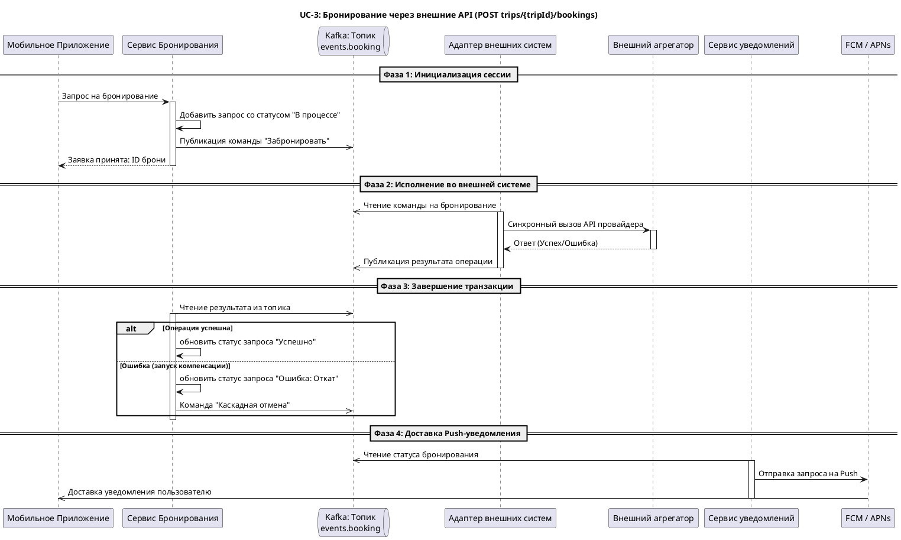

```plantuml
@startuml
title UC-3: Бронирование через внешние API (POST trips/{tripId}/bookings)

participant "Мобильное Приложение" as App
participant "Сервис Бронирования" as Saga
queue "Kafka: Топик\nevents.booking" as K_book
participant "Адаптер внешних систем" as Adapter
participant "Внешний агрегатор" as GDS
participant "Сервис уведомлений" as Push
participant "FCM / APNs" as Cloud

== Фаза 1: Инициализация сессии ==

App -> Saga: Запрос на бронирование
activate Saga
Saga -> Saga: Добавить запрос со статусом "В процессе"
Saga ->> K_book: Публикация команды "Забронировать"
Saga --> App: Заявка принята: ID брони
deactivate Saga

== Фаза 2: Исполнение во внешней системе ==


Adapter ->> K_book: Чтение команды на бронирование
activate Adapter
Adapter -> GDS: Синхронный вызов API провайдера
activate GDS
GDS --> Adapter: Ответ (Успех/Ошибка)
deactivate GDS
Adapter ->> K_book: Публикация результата операции
deactivate Adapter

== Фаза 3: Завершение транзакции ==

Saga ->> K_book: Чтение результата из топика
activate Saga
alt Операция успешна
    Saga -> Saga: обновить статус запроса "Успешно"
else Ошибка (запуск компенсации)
    Saga -> Saga: обновить статус запроса "Ошибка: Откат"
    Saga ->> K_book: Команда "Каскадная отмена"
end
deactivate Saga

== Фаза 4: Доставка Push-уведомления ==

Push ->> K_book: Чтение статуса бронирования
activate Push
Push -> Cloud: Отправка запроса на Push
Cloud ->> App: Доставка уведомления пользователю
deactivate Push

@enduml
```
